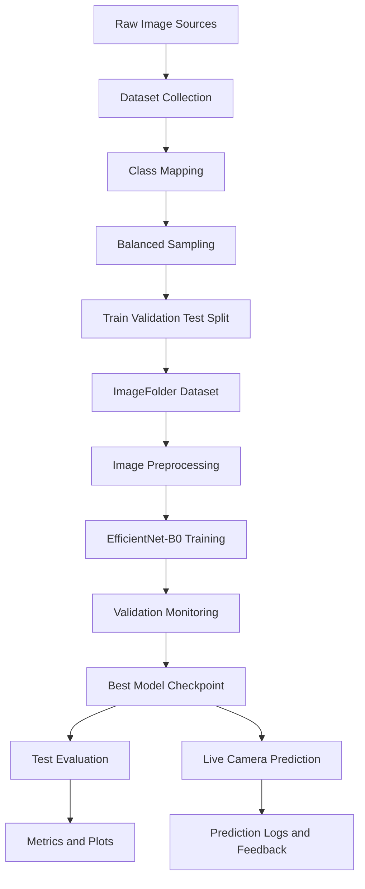
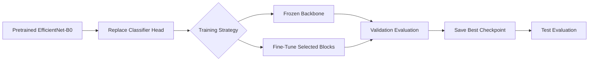
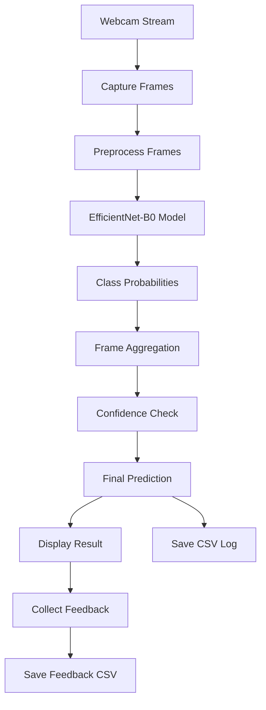

# EfficientNet-B0 Lighting Condition Classification

## Project Name

EfficientNet-B0 Lighting Condition Classification

Recommended GitHub repository name:

```text
efficientnet-lighting-classification
```

## Project Overview

This project presents a complete deep learning pipeline for classifying image lighting conditions into three classes.

```text
low
normal
over
```

The system uses transfer learning with EfficientNet-B0.

The project starts with dataset preparation.

It unifies different image sources into one clean ImageFolder dataset.

It then trains and evaluates multiple EfficientNet-B0 models.

The final version supports offline evaluation and live camera prediction.

The project is designed as an academic computer vision project with a full workflow.

It includes:

- dataset preparation
- class balancing
- transfer learning
- frozen feature extraction
- fine-tuning
- test evaluation
- visual metrics
- live camera inference
- CSV logging
- user feedback collection

## Problem Statement

Lighting quality affects computer vision systems.

Images captured in poor lighting can reduce model performance in face analysis, object recognition, robotics, and surveillance systems.

This project addresses the task of identifying lighting conditions in images.

The model classifies each image into one of three lighting categories:

| Class | Meaning |
|---|---|
| low | Underexposed or low-light image |
| normal | Balanced lighting image |
| over | Overexposed or high-brightness image |

The goal is to build a reliable classification system that can support image quality assessment before further computer vision processing.

## Project Objectives

The main objectives are:

- Build a lighting condition classification dataset
- Combine low, normal, and overexposed images into one structure
- Train an EfficientNet-B0 model using transfer learning
- Compare frozen training and fine-tuning strategies
- Evaluate the model using accuracy, F1-score, balanced accuracy, and confusion matrix
- Generate ROC, precision-recall, calibration, and score distribution plots
- Run live inference using a webcam
- Save prediction logs and feedback data
- Prepare the project for academic presentation and GitHub publishing

## Dataset Sources

The notebook uses image data from multiple local folders.

The dataset preparation stage combines:

```text
LOL dataset
GT_IMAGES
INPUT_IMAGES
```

The LOL dataset is used for low-light and normal-light images.

The overexposed class is collected from overexposure image folders.

The final output is a unified dataset with three balanced classes.

## Final Dataset Structure

The dataset is converted into a PyTorch ImageFolder format.

```text
UNIFIED_DATA/
│
├── train/
│   ├── low/
│   ├── normal/
│   └── over/
│
├── val/
│   ├── low/
│   ├── normal/
│   └── over/
│
└── test/
    ├── low/
    ├── normal/
    └── over/
```

## Dataset Size

The notebook produced the following balanced dataset:

| Split | Low | Normal | Over | Total |
|---|---:|---:|---:|---:|
| Train | 341 | 341 | 341 | 1023 |
| Validation | 72 | 72 | 72 | 216 |
| Test | 72 | 72 | 72 | 216 |
| Total | 485 | 485 | 485 | 1455 |

The balanced design helps reduce class bias during model training and evaluation.

## System Workflow



## Methodology

### 1. Dataset Preparation

The dataset preparation script searches for image files using common image extensions.

Supported formats include:

```text
.jpg
.jpeg
.png
.bmp
.webp
```

The script creates the final dataset structure automatically.

It also creates a new output folder when a previous unified dataset already exists.

Example output folder:

```text
UNIFIED_DATA_002
```

The preparation stage performs:

- image discovery
- class grouping
- train, validation, and test splitting
- optional copying or moving of images
- class balancing through undersampling
- final ImageFolder directory creation

### 2. Data Validation

The notebook includes dataset checking cells.

These cells confirm:

- available dataset folders
- selected dataset path
- existing train, validation, and test splits
- class names
- number of images per class
- total number of images per split

This step ensures that training starts from a valid dataset.

### 3. Image Preprocessing

The model uses standard image preprocessing for EfficientNet-B0.

Input images are resized and normalized before training or inference.

The input size is:

```text
224 x 224
```

Training transformations include augmentation.

Evaluation transformations use stable preprocessing to keep validation and test results consistent.

### 4. Model Selection

The project uses EfficientNet-B0 from torchvision.

EfficientNet-B0 is suitable for this project because it provides a strong balance between accuracy and computational cost.

It is light enough for CPU-based experiments and strong enough for image classification tasks.

The pretrained classifier head is replaced with a new output layer for three classes.

```text
Input Image
    ↓
Preprocessing
    ↓
EfficientNet-B0 Feature Extractor
    ↓
Custom Classifier Head
    ↓
Softmax Probabilities
    ↓
low / normal / over
```

## Training Approaches

The notebook includes three main training stages.

### Stage 1: Frozen EfficientNet-B0

In this stage, the pretrained EfficientNet-B0 backbone is frozen.

Only the classifier head is trained.

This stage is useful as a baseline.

It tests whether pretrained visual features are enough for lighting condition classification.

Main settings:

| Parameter | Value |
|---|---:|
| Epochs | 10 |
| Batch size | 64 |
| Learning rate | 0.001 |
| Weight decay | 0.0001 |
| Device used in notebook | CPU |

Saved outputs:

```text
best_frozen.pt
metrics_frozen.json
confusion_frozen.png
```

### Stage 2: Standard Fine-Tuning

In this stage, selected layers of EfficientNet-B0 are unfrozen.

The model learns more task-specific features while keeping useful pretrained knowledge.

Main settings:

| Parameter | Value |
|---|---:|
| Epochs | 20 |
| Batch size | 64 |
| Learning rate | 0.0001 |
| Weight decay | 0.0001 |

Saved outputs:

```text
best_finetune.pt
metrics.json
confusion.png
```

### Stage 3: Scientific Fine-Tuning

The notebook also includes a cleaner fine-tuning pipeline.

It supports explicit unfreezing modes.

Available modes include:

```text
head_only
block7_head
blocks67_head
full
```

The strongest notebook run used:

```text
blocks67_head
```

This means the model fine-tunes the later EfficientNet blocks and the classifier head.

The training stack includes:

- label smoothing
- Mixup
- AdamW optimizer
- cosine learning rate scheduling
- exponential moving average
- test-time augmentation using horizontal flip
- early stopping
- validation macro F1-score model selection

This stage is the strongest training pipeline in the notebook.

## Model Training Flow



## Evaluation Metrics

The project evaluates the trained models using several metrics.

| Metric | Purpose |
|---|---|
| Accuracy | Measures total correct predictions |
| Macro F1-score | Gives equal importance to all classes |
| Micro F1-score | Measures global classification performance |
| Weighted F1-score | Accounts for class support |
| Balanced accuracy | Useful when class distribution may be uneven |
| Confusion matrix | Shows class-level prediction errors |
| Classification report | Shows precision, recall, and F1 per class |
| ROC curve | Analyzes class separation |
| Precision-recall curve | Evaluates precision and recall behavior |
| Calibration curve | Checks confidence reliability |
| Score histogram | Shows probability distribution per class |

## Reported Results

### Frozen EfficientNet-B0

Validation results:

```text
Accuracy: 0.9028
Macro F1-score: 0.9033
Balanced accuracy: 0.9028
```

Test results:

```text
Accuracy: 0.9352
Macro F1-score: 0.9350
Micro F1-score: 0.9352
Weighted F1-score: 0.9350
Balanced accuracy: 0.9352
```

### Standard Fine-Tuned EfficientNet-B0

Validation results:

```text
Accuracy: 0.9537
Macro F1-score: 0.9542
Balanced accuracy: 0.9537
```

Test results:

```text
Accuracy: 0.9537
Macro F1-score: 0.9540
Micro F1-score: 0.9537
Weighted F1-score: 0.9540
Balanced accuracy: 0.9537
```

### Scientific Fine-Tuned EfficientNet-B0

Validation results:

```text
Accuracy: 0.9583
Macro F1-score: 0.9588
Balanced accuracy: 0.9583
```

Test results:

```text
Accuracy: 0.9769
Macro F1-score: 0.9770
Micro F1-score: 0.9769
Weighted F1-score: 0.9770
Balanced accuracy: 0.9769
```

## Best Model

The best model in the notebook is the scientific fine-tuned EfficientNet-B0 model.

It achieved the highest test performance.

| Model | Test Accuracy | Test Macro F1 | Test Balanced Accuracy |
|---|---:|---:|---:|
| Frozen EfficientNet-B0 | 0.9352 | 0.9350 | 0.9352 |
| Fine-Tuned EfficientNet-B0 | 0.9537 | 0.9540 | 0.9537 |
| Scientific Fine-Tuned EfficientNet-B0 | 0.9769 | 0.9770 | 0.9769 |

## Best Model Classification Report

The best model produced the following test classification report:

| Class | Precision | Recall | F1-score | Support |
|---|---:|---:|---:|---:|
| low | 1.0000 | 0.9722 | 0.9859 | 72 |
| normal | 0.9351 | 1.0000 | 0.9664 | 72 |
| over | 1.0000 | 0.9583 | 0.9787 | 72 |

Overall test accuracy:

```text
0.9769
```

## Live Camera Inference

The notebook includes a live prediction module using OpenCV.

The live system:

- opens the webcam
- captures multiple frames
- preprocesses each frame
- predicts lighting class probabilities
- aggregates predictions across frames
- applies a confidence threshold
- displays the result
- saves prediction logs
- asks for user feedback

Main live inference settings:

| Setting | Value |
|---|---:|
| Image size | 224 |
| Number of frames | 5 |
| Confidence threshold | 0.60 |
| Camera index | 0 |

Output CSV files:

```text
pred_runs.csv
pred_runs_feedback.csv
```

The CSV files support later review of model predictions and user feedback.

## Live Inference Flow



## Repository Structure

Recommended GitHub structure:

```text
efficientnet-lighting-classification/
│
├── README.md
├── lighting_task.ipynb
├── requirements.txt
│
├── data/
│   └── README.md
│
├── artifacts/
│   ├── best_frozen.pt
│   ├── best_finetune.pt
│   ├── metrics.json
│   ├── metrics_frozen.json
│   └── confusion.png
│
├── outputs/
│   ├── pred_runs.csv
│   └── pred_runs_feedback.csv
│
└── figures/
    ├── confusion_matrix.png
    ├── roc_curve.png
    ├── precision_recall_curve.png
    ├── calibration_curve.png
    └── score_histograms.png
```

## Installation

### 1. Clone the repository

```bash
git clone https://github.com/your-username/efficientnet-lighting-classification.git
cd efficientnet-lighting-classification
```

### 2. Create a virtual environment

Windows:

```bash
python -m venv venv
venv\Scripts\activate
```

macOS or Linux:

```bash
python -m venv venv
source venv/bin/activate
```

### 3. Install dependencies

```bash
pip install -r requirements.txt
```

## Requirements

Recommended `requirements.txt`:

```text
torch
torchvision
numpy
pandas
matplotlib
scikit-learn
opencv-python
pillow
ipython
jupyter
```

## How to Run

### 1. Open the notebook

```bash
jupyter notebook lighting_task.ipynb
```

### 2. Prepare the dataset

Run the dataset preparation cell.

This creates the unified ImageFolder dataset.

Expected structure:

```text
UNIFIED_DATA/train
UNIFIED_DATA/val
UNIFIED_DATA/test
```

### 3. Validate the dataset

Run the dataset checking cell.

Confirm that the classes are:

```text
low
normal
over
```

### 4. Train the frozen model

Run the frozen EfficientNet-B0 training section.

This creates a baseline model.

### 5. Evaluate the frozen model

Run the frozen model evaluation section.

It generates metrics and plots.

### 6. Train the fine-tuned model

Run the fine-tuning section.

For the best result, use the scientific fine-tuning pipeline with:

```text
blocks67_head
```

### 7. Evaluate the fine-tuned model

Run the final evaluation section.

Use the latest fine-tuned artifact folder.

### 8. Run live camera prediction

Run the live inference cell.

The webcam opens and predicts lighting conditions in real time.

Press:

```text
q
```

to stop the live stream.

## Main Files

### lighting_task.ipynb

The main notebook.

It contains:

- dataset preparation
- dataset validation
- frozen EfficientNet-B0 training
- frozen model evaluation
- fine-tuning
- scientific fine-tuning
- final evaluation
- live camera inference

### requirements.txt

Contains the Python packages needed to run the project.

### artifacts folder

Stores trained models and evaluation outputs.

### outputs folder

Stores live prediction logs and user feedback logs.

## Reproducibility

The notebook includes seed setting for reproducible experiments.

The default seed used in several parts of the project is:

```text
42
```

Dataset splitting also uses a fixed seed in the preparation script.

This helps make the train, validation, and test split consistent across runs.

## Academic Contribution

This project provides a complete lighting condition classification system using transfer learning.

The contribution includes:

- a balanced three-class lighting dataset structure
- EfficientNet-B0 baseline training
- fine-tuning comparison
- advanced fine-tuning with Mixup and label smoothing
- full test-set evaluation
- visual model diagnostics
- live camera deployment
- feedback logging for future improvement

The strongest model achieved:

```text
Test Accuracy: 97.69%
Test Macro F1-score: 97.70%
```

This result shows that EfficientNet-B0 can classify lighting conditions with strong performance when trained on a balanced dataset.

## Limitations

The current system depends on the dataset used during training.

Possible limitations include:

- limited dataset diversity
- possible camera-specific bias
- limited testing under real-world lighting variation
- possible confusion between normal and slightly overexposed images
- no external dataset validation
- no explainability method such as Grad-CAM included yet

## Future Work

Recommended future improvements:

- add Grad-CAM visual explanations
- test on external lighting datasets
- deploy using Streamlit or FastAPI
- export the model to ONNX
- add automatic image quality scoring
- add brightness and contrast statistical features
- compare EfficientNet-B0 with ResNet, MobileNet, and Vision Transformer
- add real-time dashboard for prediction logs
- improve calibration for confidence-based decisions
- add a larger real-world dataset from different cameras

## Ethical and Practical Considerations

This project does not identify people.

It classifies image lighting quality.

Still, camera-based systems should handle visual data carefully.

Practical deployment should consider:

- privacy
- user consent
- local data storage
- secure handling of captured frames
- clear explanation of model limitations


## Summary

This repository implements a complete lighting condition classification system using EfficientNet-B0.

It classifies images into low, normal, and overexposed lighting conditions.

The project includes dataset preparation, training, fine-tuning, evaluation, live inference, and feedback logging.

The best model achieved 97.69% test accuracy and 97.70% test macro F1-score.
